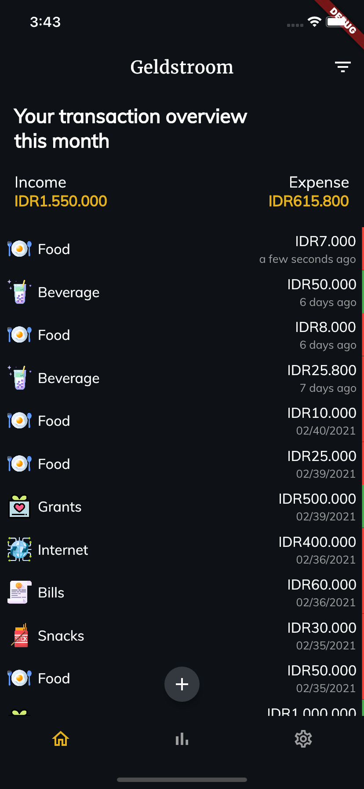
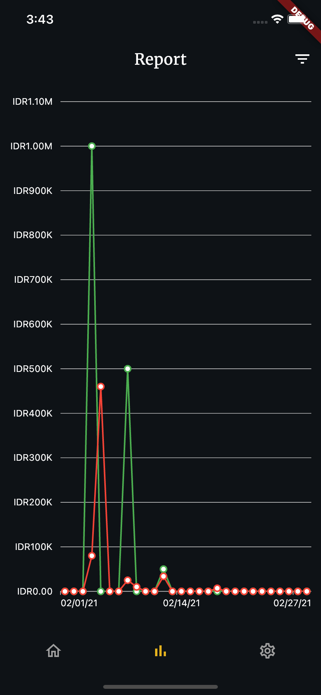
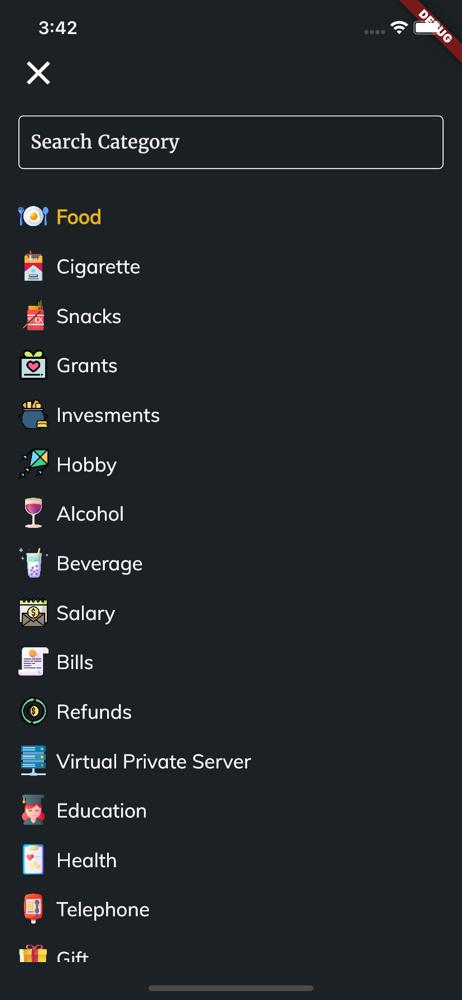
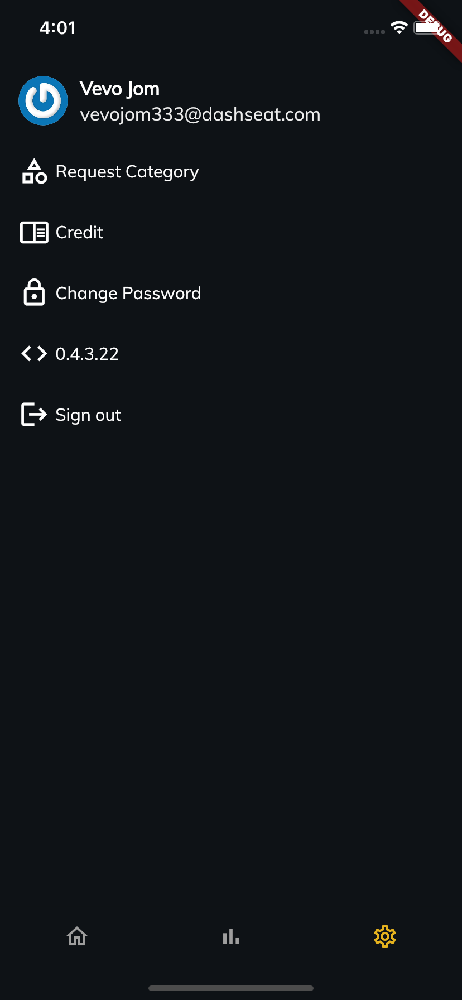

  [](https://codecov.io/gh/novaladip/geldstroom-client-flutter) 

# Geldstroom

***Geldstroom*** is an app to help you manage your income & expense, categorizing every penny you spend so you can make better future decisions. I build this app as my journey learning *flutter*, *unit test*, *widget test*, ***CI***, and ***CD***.

<a  href='https://play.google.com/store/apps/details?id=com.cotc.geldstroom&pcampaignid=pcampaignidMKT-Other-global-all-co-prtnr-py-PartBadge-Mar2515-1'></a>

# Folder Structure
```
├── core                    # core - Business logic layer
│   ├── bloc                # bloc - responsible for communicates with a service layer
│   ├── bloc_base           # bloc_base - a core bloc that can be extended to other blocs
│   ├── bloc_ui             # bloc_ui - responsible for updating UI
│   └── network             # network - Network layer
│       ├── dto             # dto - stand for Data Transfer Object used as a part for communicates with the service layer. e.g for the URL parameter, the request body
│       ├── model           # model - responsible for modeling data that recieved from server API
│       └── service         # service - responsible for communicates with server API, accepting DTO as an input and return model
├── gen                     # gen - contains a file that being generated by code generator e.g Assets
├── shared                  # shared - shared code widely used on other layers
│   ├── common              # common - contains config, style and utilities that widely used on other layers
│   │   ├── config
│   │   ├── styles
│   │   └── utils
│   └── widget              # widget - contains a useable widgets that widely used on across widgets
└── ui                      # ui - contains a page widget    
    ├── somepage
    │   └── widgets         # page/widgets - contains a widgets that only used once
```


## Screenshot
|              Home               |              Rerport              |
| :----------------------------------: | :-----------------------------: |
|  |  |
|              Select Category              |             Setting              |
|  |  |